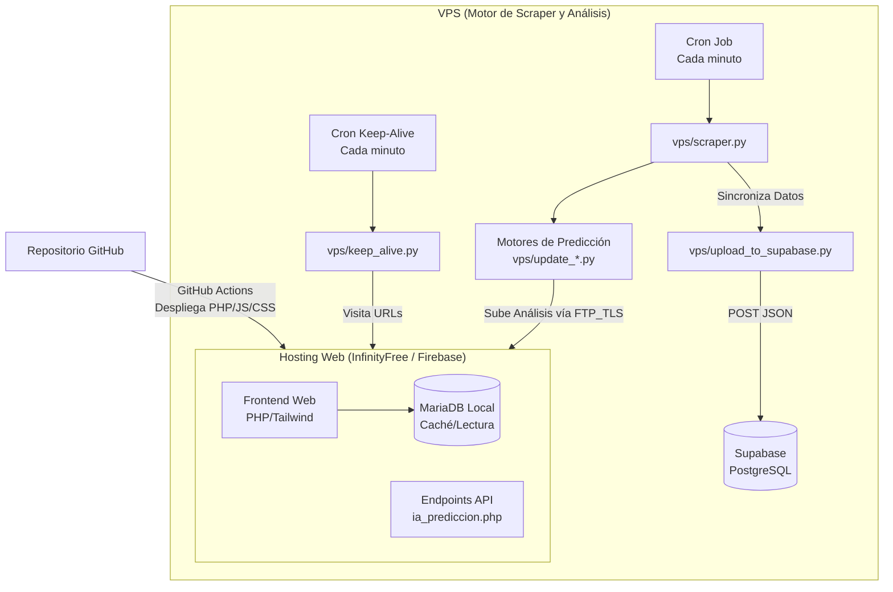

# SmartLottery RD — Arquitectura, Despliegue y Migración de Emergencia

Sistema automatizado de recopilación y análisis de las loterías de República Dominicana.
**ESTE DOCUMENTO ESTÁ DISEÑADO PARA SER LEÍDO POR AGENTES DE INTELIGENCIA ARTIFICIAL Y HUMANOS.** 
Contiene la arquitectura exacta y los pasos de migración a prueba de fallos para levantar el proyecto desde cero en cualquier infraestructura (InfinityFree, Firebase, VPS, etc.).

## 🏗 Arquitectura del Sistema

El sistema está dividido en dos grandes bloques para evadir las limitaciones severas de los hostings gratuitos (como InfinityFree: límites de max_queries_per_hour, límites de CPU, y bloqueos de seguridad anti-bots).



### 1. El Frontend / Hosting Web (Actualmente en InfinityFree)
- **Tecnologías:** PHP 8+, JavaScript Vanilla, Tailwind CSS.
- **Dominio Base:** `https://numerosrd.42web.io/lottery/`
- **Funcionalidad:** Sirve la interfaz de usuario, procesa análisis estadísticos usando la API de OpenRouter, y muestra los resultados. Usa una base de datos MariaDB puramente como caché de lectura (los datos llegan desde el VPS).
- **Despliegue:** 100% automatizado mediante GitHub Actions (`.github/workflows/ftp-deploy.yml`).

### 2. El Cerebro (VPS) y Almacenamiento Maestro (Supabase)
- **Tecnologías:** Python 3.9+
- **Funcionalidad:** Rastrea resultados diariamente (`vps/scraper.py`) y ejecuta los algoritmos de predicción.
- **Fuente de la Verdad:** El VPS mantiene el estado real de toda la base de datos localmente (`db_backup.json` y `historial_*.txt`). InfinityFree NO es la fuente confiable.
- **Resiliencia y Backups (Supabase):** Para no depender de un hosting gratuito, los datos extraídos se respaldan permanentemente a **Supabase** (PostgreSQL) vía API REST (`vps/upload_to_supabase.py`).
- **Anti-Suspensión:** El VPS corre un script `vps/keep_alive.py` cada minuto que genera tráfico simulado visitando la web para evitar que InfinityFree suspenda la cuenta por inactividad.

---

## 🚀 Guía de Recuperación y Migración (Para Agentes de IA)

Si el hosting actual (InfinityFree) cae, elimina la cuenta, o el dueño decide migrar a Google Firebase o cualquier otro proveedor, **sigue estos pasos exactos para levantar el proyecto en minutos**. El proyecto está diseñado para no perder un solo byte de información.

### 📦 ¿Dónde están los datos de respaldo?
Si el hosting muere, los datos están seguros y fuera de peligro:
1. **Base de Datos:** Está en tu proyecto de **Supabase**. El VPS actualiza los sorteos en Supabase constantemente a través de `vps/upload_to_supabase.py`.
2. **Historial Maestro de Análisis:** El VPS tiene todos los cálculos crudos guardados localmente (`/home/ubuntu/historial_quinielas.txt`, etc) y el archivo de construcción local (`db_backup.json`).
3. **Código Fuente:** Se guarda un snapshot diario a las 04:00 AM en `/home/ubuntu/Lottery-Backup/lottery_backup_YYYY-MM-DD.tar.gz`.

### Paso 1: Configurar el Nuevo Hosting / Base de Datos
1. Si usas una base de datos local en el nuevo host (como caché, igual que en InfinityFree), solo debes correr el script de migración para inicializar la tabla:
   ```bash
   php scripts/migrar.php
   ```
2. **Sincronización:** Los datos llegarán desde el VPS (porque el VPS seguirá procesando y enviando los JSON a través del cron). Si necesitas importar la base de datos histórica completa, la puedes exportar directo desde Supabase en formato SQL/CSV, o usar `db_backup.json` que está guardado dentro del VPS.

### Paso 2: Configurar los Secretos en el Nuevo Hosting
En el nuevo hosting, debes subir manualmente el archivo `secrets.php` (no está en el repo por seguridad). El archivo debe contener:
```php
<?php
return [
    'db_host' => 'tu-nuevo-host',
    'db_name' => 'nombre-db',
    'db_user' => 'usuario',
    'db_pass' => 'password',
    'admin_hash' => 'hash-bcrypt-de-la-clave-del-panel',
    'ingest_token' => 'tu-token-secreto-hexadecimal',
    'openrouter_key' => 'sk-or-v1-...',
    'app_env' => 'production'
];
```

### Paso 3: Desplegar el Código al Nuevo Hosting
1. Si usas un hosting clásico con FTP, simplemente actualiza los secretos (`FTP_USERNAME` y `FTP_PASSWORD`) en tu repositorio de GitHub (Settings -> Secrets -> Actions).
2. Haz un `git push`. GitHub Actions compilará Tailwind CSS y subirá todo el proyecto al nuevo servidor automáticamente.
3. *Alternativa (Firebase):* Si migras a Firebase Hosting (solo admite archivos estáticos), deberás reescribir las rutas PHP a Cloud Functions o usar un backend serverless, y mantener el frontend en HTML/JS puro. (El proyecto actualmente depende de PHP 8+ para interactuar con la DB y OpenRouter).

### Paso 4: Actualizar las Credenciales en el VPS
Conéctate al VPS (`ssh server2`) y edita el archivo maestro de entorno:
```bash
sudo nano /etc/lottery.env
```
Actualiza las credenciales para que apunten al nuevo servidor:
```bash
LOTTERY_FTP_HOST="ftp.nuevo-servidor.com"
LOTTERY_FTP_USER="nuevo-usuario"
LOTTERY_FTP_PASS="nueva-clave"
LOTTERY_FTP_DIR="htdocs/o/public_html/lottery"
LOTTERY_INGEST_TOKEN="tu-token-secreto-hexadecimal" # El mismo de secrets.php
LOTTERY_SITE_URL="https://tu-nuevo-dominio.com/lottery" # IMPORTANTE para Keep-Alive
```

### Paso 5: Reiniciar los Cron Jobs
El VPS tiene los siguientes cron jobs activos (`crontab -e`). Asegúrate de que estén corriendo:
```cron
* * * * * set -a; . /etc/lottery.env; set +a; cd /home/ubuntu && /usr/bin/python3 -m vps.scraper >> /home/ubuntu/cron.log 2>&1
* * * * * set -a; . /etc/lottery.env; set +a; cd /home/ubuntu && /usr/bin/python3 -m vps.keep_alive >> /home/ubuntu/keep_alive.log 2>&1
0 2 * * * python3 /home/ubuntu/vps_backup.py
0 4 * * * ~/Lottery-Backup/backup_project.sh
```
- `vps.scraper`: Extrae loterías y sube análisis cada minuto.
- `vps.keep_alive`: Evita suspensiones visitando el sitio y descargando el backup de la base de datos cada minuto.

## 🛡 Consideraciones Críticas (Protocolos de Seguridad)
- **Subida de Archivos:** Las conexiones al servidor de hosting **siempre** deben usar FTP sobre TLS explícito (`FTP_TLS` en `vps/ftp_cliente.py`). No envíes contraseñas en texto plano.
- **Escritura Atómica:** El cliente FTP sube los archivos temporalmente con un prefijo `.` y los renombra al final para evitar que la web del hosting intente leer un JSON a medio subir y muestre errores en pantalla.
- **Protección CORS & Headers:** El archivo `app/Http.php` gestiona la seguridad global, controlando orígenes para las peticiones de Inteligencia Artificial, y emitiendo cabeceras de seguridad estrictas.
- **Falsedad Estadística (Ley de Probabilidades):** Cuando trabajes con la API de IA (OpenRouter), NUNCA le pidas que "justifique matemáticamente" por qué un número va a salir hoy basado en retrasos (Falacia del Jugador). Instruye a la IA para que sea honesta indicando que los sorteos son eventos independientes, pero interpretando la estrategia de descarte humano. (Implementado en `api_chat_quiniela.php`).
