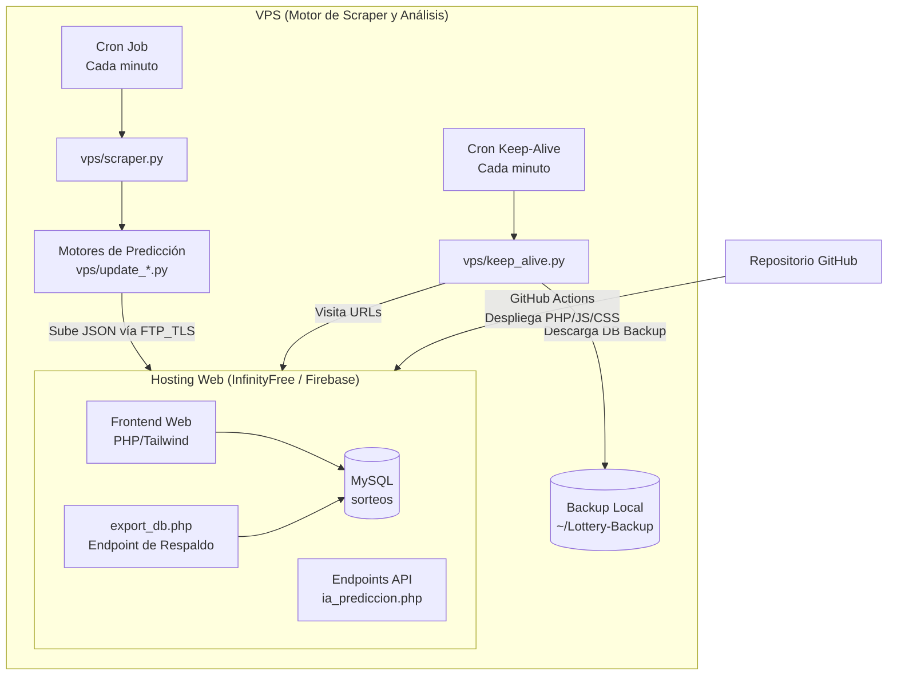

# SmartLottery RD — Arquitectura, Despliegue y Migración de Emergencia

Sistema automatizado de recopilación y análisis de las loterías de República Dominicana.
**ESTE DOCUMENTO ESTÁ DISEÑADO PARA SER LEÍDO POR AGENTES DE INTELIGENCIA ARTIFICIAL Y HUMANOS.** 
Contiene la arquitectura exacta y los pasos de migración a prueba de fallos para levantar el proyecto desde cero en cualquier infraestructura (InfinityFree, Firebase, VPS, etc.).

## 🏗 Arquitectura del Sistema

El sistema está dividido en dos grandes bloques para evadir las limitaciones severas de los hostings gratuitos (como InfinityFree: límites de max_queries_per_hour, límites de CPU, y bloqueos de seguridad anti-bots).



### 1. El Frontend / Hosting Web (Actualmente en InfinityFree)
- **Tecnologías:** PHP 8+, JavaScript Vanilla, Tailwind CSS.
- **Dominio Base:** `https://numerosrd.42web.io/lottery/`
- **Funcionalidad:** Sirve la interfaz de usuario, procesa los análisis estadísticos de la IA usando la API de OpenRouter (`api_ia.php`, `api_chat_quiniela.php`) y muestra los resultados desde la base de datos MySQL.
- **Despliegue:** 100% automatizado mediante GitHub Actions (`.github/workflows/ftp-deploy.yml`). Al hacer un `git push` a `master`, se sube el código fuente vía FTP al hosting.

### 2. El Cerebro (VPS)
- **Tecnologías:** Python 3.9+
- **Funcionalidad:** Rastrea resultados diariamente (`vps/scraper.py`), ejecuta los algoritmos de predicción estadísticos, y sube los resultados al hosting en formato `.json` cifrado mediante TLS (`vps/ftp_cliente.py`).
- **Resiliencia (Anti-Suspensión y Backups):** El VPS corre un script `vps/keep_alive.py` cada minuto que:
  1. Genera tráfico simulado visitando la web para evitar que InfinityFree suspenda la cuenta por inactividad.
  2. Descarga la base de datos MySQL completa interactuando con el endpoint secreto `export_db.php`.

---

## 🚀 Guía de Recuperación y Migración (Para Agentes de IA)

Si el hosting actual (InfinityFree) cae, elimina la cuenta, o el dueño decide migrar a Google Firebase o cualquier otro proveedor, **sigue estos pasos exactos para levantar el proyecto en minutos**. El proyecto está diseñado para no perder un solo byte de información.

### 📦 ¿Dónde están los datos de respaldo?
Si el hosting muere, el VPS tiene todo respaldado hasta el último minuto:
1. **Base de Datos MySQL (`sorteos`):** El VPS la descarga cada minuto. Búscala en el VPS en la ruta `/home/ubuntu/Lottery-Backup/db_completa_YYYY-MM-DD.json`.
2. **Archivos Crudos y Código del Hosting:** Se respaldan todos los días a las 04:00 AM. Búscalos en `/home/ubuntu/Lottery-Backup/lottery_backup_YYYY-MM-DD.tar.gz`.
3. **Historial Maestro de Análisis:** El motor de Python mantiene su propia fuente de la verdad en `/home/ubuntu/historial_quinielas.txt`, `historial_pales.txt`, etc.

### Paso 1: Configurar el Nuevo Hosting / Base de Datos
1. Crea una base de datos MySQL en el nuevo proveedor.
2. Clona el repositorio y ejecuta el script de migración local para crear la tabla de sorteos:
   ```bash
   php scripts/migrar.php
   ```
3. **Restaurar los Datos:** Toma el último backup `db_completa_YYYY-MM-DD.json` del VPS y escribe un script rápido en PHP o Python que inserte esos registros en la nueva base de datos. La estructura del JSON es directamente un array de objetos `{fecha, nombre, primera, segunda, tercera}`.

### Paso 2: Configurar los Secretos en el Nuevo Hosting
En el nuevo hosting, debes subir manualmente el archivo `secrets.php` (no está en el repo por seguridad). El archivo debe contener:
```php
<?php
return [
    'db_host' => 'tu-nuevo-host',
    'db_name' => 'nombre-db',
    'db_user' => 'usuario',
    'db_pass' => 'password',
    'admin_hash' => 'hash-bcrypt-de-la-clave-del-panel',
    'ingest_token' => 'tu-token-secreto-hexadecimal',
    'openrouter_key' => 'sk-or-v1-...',
    'app_env' => 'production'
];
```

### Paso 3: Desplegar el Código al Nuevo Hosting
1. Si usas un hosting clásico con FTP, simplemente actualiza los secretos (`FTP_USERNAME` y `FTP_PASSWORD`) en tu repositorio de GitHub (Settings -> Secrets -> Actions).
2. Haz un `git push`. GitHub Actions compilará Tailwind CSS y subirá todo el proyecto al nuevo servidor automáticamente.
3. *Alternativa (Firebase):* Si migras a Firebase Hosting (solo admite archivos estáticos), deberás reescribir las rutas PHP a Cloud Functions o usar un backend serverless, y mantener el frontend en HTML/JS puro. (El proyecto actualmente depende de PHP 8+ para interactuar con la DB y OpenRouter).

### Paso 4: Actualizar las Credenciales en el VPS
Conéctate al VPS (`ssh server2`) y edita el archivo maestro de entorno:
```bash
sudo nano /etc/lottery.env
```
Actualiza las credenciales para que apunten al nuevo servidor:
```bash
LOTTERY_FTP_HOST="ftp.nuevo-servidor.com"
LOTTERY_FTP_USER="nuevo-usuario"
LOTTERY_FTP_PASS="nueva-clave"
LOTTERY_FTP_DIR="htdocs/o/public_html/lottery"
LOTTERY_INGEST_TOKEN="tu-token-secreto-hexadecimal" # El mismo de secrets.php
LOTTERY_SITE_URL="https://tu-nuevo-dominio.com/lottery" # IMPORTANTE para Keep-Alive
```

### Paso 5: Reiniciar los Cron Jobs
El VPS tiene los siguientes cron jobs activos (`crontab -e`). Asegúrate de que estén corriendo:
```cron
* * * * * set -a; . /etc/lottery.env; set +a; cd /home/ubuntu && /usr/bin/python3 -m vps.scraper >> /home/ubuntu/cron.log 2>&1
* * * * * set -a; . /etc/lottery.env; set +a; cd /home/ubuntu && /usr/bin/python3 -m vps.keep_alive >> /home/ubuntu/keep_alive.log 2>&1
0 2 * * * python3 /home/ubuntu/vps_backup.py
0 4 * * * ~/Lottery-Backup/backup_project.sh
```
- `vps.scraper`: Extrae loterías y sube análisis cada minuto.
- `vps.keep_alive`: Evita suspensiones visitando el sitio y descargando el backup de la base de datos cada minuto.

## 🛡 Consideraciones Críticas (Protocolos de Seguridad)
- **Subida de Archivos:** Las conexiones al servidor de hosting **siempre** deben usar FTP sobre TLS explícito (`FTP_TLS` en `vps/ftp_cliente.py`). No envíes contraseñas en texto plano.
- **Escritura Atómica:** El cliente FTP sube los archivos temporalmente con un prefijo `.` y los renombra al final para evitar que la web del hosting intente leer un JSON a medio subir y muestre errores en pantalla.
- **Protección CORS & Headers:** El archivo `app/Http.php` gestiona la seguridad global, controlando orígenes para las peticiones de Inteligencia Artificial, y emitiendo cabeceras de seguridad estrictas.
- **Falsedad Estadística (Ley de Probabilidades):** Cuando trabajes con la API de IA (OpenRouter), NUNCA le pidas que "justifique matemáticamente" por qué un número va a salir hoy basado en retrasos (Falacia del Jugador). Instruye a la IA para que sea honesta indicando que los sorteos son eventos independientes, pero interpretando la estrategia de descarte humano. (Implementado en `api_chat_quiniela.php`).
