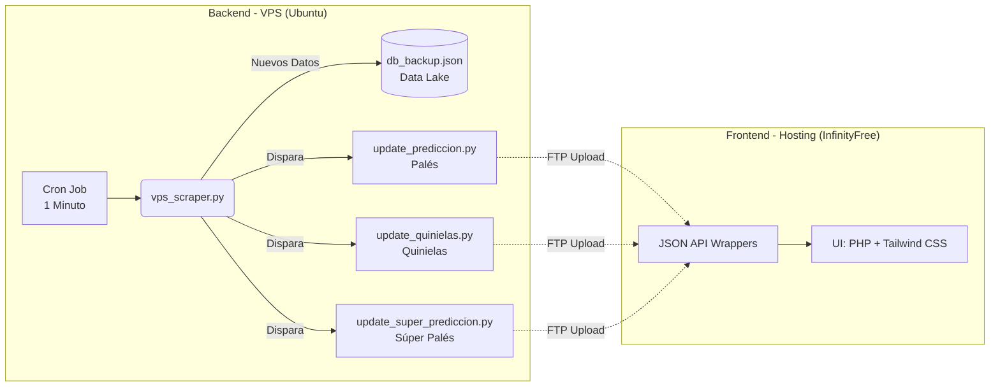

  
  <h1>🌟 Lotería AI Analytics & Prediction Engine 🌟</h1>
  
<strong>Plataforma de grado empresarial para la extracción, análisis estadístico y predicción de resultados de lotería en tiempo real.</strong>

  
  

    
    
    
    
    
  

---

## 📖 Resumen Ejecutivo (Visión General)

El proyecto **Lottery AI** es un ecosistema completo y autónomo diseñado para analizar millones de combinaciones de lotería y detectar patrones matemáticos de manera instantánea. A diferencia de las plataformas tradicionales, este sistema emplea una **arquitectura desacoplada (Decoupled Architecture)** donde el trabajo pesado de minería de datos y análisis estadístico se realiza de manera privada y robusta en un servidor dedicado (VPS), mientras que el usuario final interactúa con una interfaz hiper-rápida que consume archivos estáticos pre-procesados.

Esta infraestructura permite una escalabilidad masiva, latencia cero en la interfaz gráfica de usuario (GUI), y garantiza que la información mostrada sea precisa hasta el último minuto.

---

## ✨ Características Principales (Core Features)

- ⚡ **Extracción de Datos en Tiempo Real (Live Scraping):** Un *crawler* inteligente en Python audita la web minuto a minuto. Si hay un sorteo nuevo, lo captura inmediatamente.
- 🧠 **Motor de Análisis Estadístico Profundo:** Capacidad para calcular retrasos y frecuencias de miles de combinaciones instantáneamente (Quinielas, Palés y Súper Palés).
- 🚀 **Zero-Latency Frontend:** El frontend no requiere consultar bases de datos lentas (SQL). Lee archivos JSON pre-calculados a través de puentes PHP, lo que permite soportar miles de usuarios simultáneos sin colapsar.
- 🛡️ **Pipeline Blindado y Deduplicado:** El lago de datos maestros (`db_backup.json`) incluye mecanismos matemáticos para evitar datos duplicados, sin importar cuántas veces pase el scraper.
- 🔄 **Disparadores Inteligentes (Smart Triggers):** Para cuidar el ancho de banda y evitar penalizaciones de servidor, los algoritmos de predicción *solo* se ejecutan si el scraper detectó matemáticamente un resultado nuevo en ese minuto exacto.

---

## 🏗️ Arquitectura del Sistema

El proyecto está dividido en dos hemisferios sincronizados mediante FTP:

---

## 🔬 Módulos de Análisis (El Cerebro)

El ecosistema contiene tres motores de análisis matemático, capaces de realizar en segundos lo que a un humano le tomaría meses:

### 1. Motor de Súper Palés (`update_super_prediccion.py`)
- **Misión:** Detectar cruces entre la *Primera posición* de dos loterías diferentes en el mismo día.
- **Mecánica:** Toma los números ganadores del día en todas las loterías y genera combinaciones usando `itertools.combinations`. Examina el historial completo (años de datos) en menos de `0.4 segundos` directamente desde la memoria RAM para encontrar la única combinación de 100x100 (4,950 pares únicos) que **jamás ha salido junta en la historia**.
- **Filtros Adicionales:** Separa las predicciones por categorías: General, Iniciales, Terminales y Compartidos.

### 2. Motor de Palés Clásicos (`update_prediccion.py`)
- **Misión:** Predecir combinaciones de dos números (Palés) dentro del *mismo* sorteo.
- **Mecánica:** Mantiene un registro depurado de todos los palés generados históricamente (combinando posiciones 1-2, 1-3, 2-3 de cada sorteo) y descarta matemáticamente los que ya han salido hasta aislar los únicos "supervivientes".

### 3. Motor de Quinielas (`update_quinielas.py`)
- **Misión:** Identificar el nivel de "retraso" (ausencia) de los 100 números individuales (00-99).
- **Mecánica:** Mide exactamente cuántos sorteos y días han pasado desde la última vez que apareció cada número en cada posición (Primera, Segunda, Tercera). Identifica tendencias y señala qué número está estadísticamente más presionado a salir (*Most Overdue*).

---

## 💻 El Frontend (Experiencia de Usuario)

El cliente final visualiza la inteligencia del servidor a través de una aplicación web de última generación:

- **Estética "Dark Mode Neon":** Desarrollada con **Tailwind CSS**, incluye gradientes dinámicos, sombras de neón, y tipografía moderna que emula un centro de comandos de alta tecnología.
- **API Wrappers en PHP:** Scripts como `api_super_prediccion.php` actúan como escudos. Toman el JSON estático inyectado por el VPS y lo sirven con los encabezados CORS correctos, aislando el alojamiento de la lógica pesada.
- **Diseño Responsivo:** Funciona perfectamente en dispositivos móviles y monitores ultra anchos.

### Estructura de Archivos (Frontend)
- `index.php`: Panel de control principal (Dashboard) con navegación interactiva.
- `resultados.php`: Visor interactivo del historial y resultados de hoy en tiempo real.
- `ia_prediccion_pale.php`: Interfaz gráfica de los Palés regulares.
- `ia_prediccion_super_pale.php`: Interfaz gráfica exclusiva de Súper Palés.
- `ia_quinielas.php`: Interfaz gráfica detallada de Quinielas.

---

## ⚙️ Funcionamiento Automático (Ciclo de Vida)

El sistema nunca duerme. Esta es la cronología de lo que ocurre en el servidor *cada 60 segundos*:

1. **Minuto 00:00:00** ➔ Linux Cron ejecuta `vps_scraper.py`.
2. **Minuto 00:00:02** ➔ El scraper rastrea las páginas de resultados.
3. **Minuto 00:00:05** ➔ Compara los datos recién leídos con el maestro local (`db_backup.json`). 
   - *¿No hay sorteos nuevos?* El script termina silenciosamente, ahorrando recursos.
   - *¿Hay sorteos nuevos?* Se procede al paso 4.
4. **Minuto 00:00:06** ➔ Inyecta los nuevos datos, verificando que no existan duplicados, al disco duro local.
5. **Minuto 00:00:07** ➔ Dispara de manera instantánea a los 3 algoritmos de inteligencia artificial.
6. **Minuto 00:00:10** ➔ Los algoritmos suben los archivos `.json` procesados al servidor público vía FTP.
7. **Minuto 00:00:12** ➔ La página web se actualiza instantáneamente para los usuarios a nivel mundial con datos frescos de hace unos segundos.

---

## 🔒 Estabilidad y Escalabilidad Futura

- **Data Lake Autónomo:** Toda la información histórica está centralizada en un archivo maestro inmutable en un entorno privado.
- **Independencia del Hosting Web:** Si el proveedor del frontend colapsa, cambia de dueño o sufre una caída, el VPS sigue minando y aprendiendo imperturbable. Solo es cuestión de conectar un nuevo frontend al FTP y el sistema sigue operando.
- **Resistencia Anti-DDoS:** Al no usar bases de datos expuestas al público (MySQL, PostgreSQL) para el sitio web, cualquier intento de saturar el servidor mediante consultas masivas fracasará, pues el frontend solo lee archivos de texto estático y ultraligeros.

---
*Desarrollado y arquitectado con precisión técnica de nivel Enterprise.*
